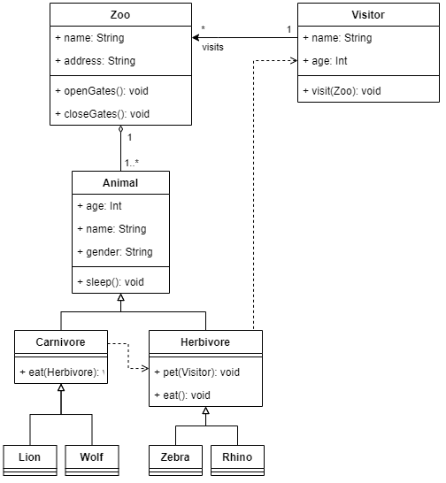
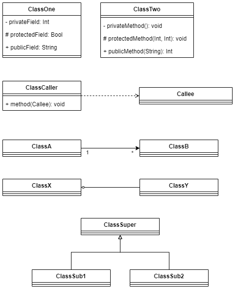
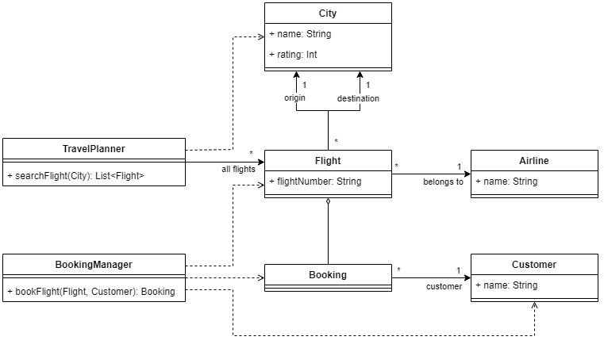

# Övningsuppgifter för klassdiagram

Varje övning består av en textbeskrivning av en domän. Uppgiften är att översätta denna text till ett klassdiagram. Varje beskrivning har en egen sida i dokumentet och på sidan efter en beskrivning finns ett förslag på lösning. Kom ihåg att det finns mer än ett rätt svar när du ritar ett klassdiagram. Så bara för att din lösning inte ser exakt ut som den i dokumentet så behöver din lösning inte vara fel.

Beskrivningarna av domänerna som används i uppgifterna är inte kompletta om du jämför dem med verkligheten. Element och funktioner som är är vanliga i verkligheten har exkluderats från övningarna för att begränsa uppgiftens storlek.

\pagebreak

## Övning 1

Domänen i den här uppgiften är ett zoo. Ett Zoo har ett namn och en adress. Det ska vara möjligta att öppna och stänga portarna till Zooet. Zooet kan besökas av besökare som ska ha ett namn. Zooet erbjuder billigare inträdde för barn och pensionärer.

På Zooet finns en grupp med djur. Varje djur har ett namn, en ålder och ett kön. Det är viktigt för zooet att skilja på växt- och köttätande djur eftersom köttätare skulle äta upp växtätarna om de skulle blandas. För närvarande har zooet två köttätande- och två växtätande djur (bestäm själv vilka djur du vill ha).

Alla djur kan sova och äta. Besökarna tillåts även klappa de växtätande djuren.

\pagebreak

### Svar övning 1

\pagebreak

## Övning 2

Den här övningen har ingen domän. Istället fokuserar den på detaljer i klassdiagramet. Flera fristående beskrivningar listas nedan och din uppgift är att rita dem i ett klassdiagram. Lösningsförslaget kommer presentera alla delar va uppgiften i ett diagram men du kan lika gärna rita flera diagram om du föredrar.

* Klassen "ClassOne" ska ha tre fält:
  * "privateField" som är av typen Int och har synlighet private,
  * "protectedField" som 'r av typen Bool och har synlighet protected,
  * "publicField" som är av typen String och har synlighet public
* Klassen "ClassTwo" ska ha tre metoder:
  * "privateMethod" som inte tar några parametrar, inte returnerar något och har synlighet private,
  * "protectedMethod" som tar två parametrar av typen Int, inte returnerar något och har synlighet protected,
  * "publicMethod" som tar en parameter av typen String, returnerar Int och har synlighet public
* Klassen "ClassCaller" ska ha en metod som tar en parameter av typen "Callee". (Obs: två klasser omnämns i beskrivningen)
* Klassen "ClassA" ska ha en 1-till-många-assosiation med klassen "ClassB"
* Mellan "ClassX" och "ClassY" finns en 1-till-1 assosiation där "ClassY" är en del av "ClassX"
* Klass "ClassSuper" ärvs av två klasser: "ClassSub1" och "ClassSub2"

\pagebreak

### Svar övning 2

\pagebreak

# Övning 3

Domänen i den här uppgiften är ett flygbiljettbokningssystem. En kund ska kunna söka efter flights. När kunden hittat en flight hen vill åka med ska det också vara möjligt att boka en plats på flighten. Det gränssnitt som kunden använder för att boka sin plats är inte del av uppgiften. Det räcker att metoderna searchFlight(...) och bookFlight(...) finns med på någon/några klasser.

När kunden söker efter en flight ska en stad från vilken kunden vill resa anges. Kunden ska få en lista med möjliga flights tillbaka. Om en flight är fullbokad ska den inte vara med i listan. Listan ska vara sorterad efter destinationens betyg. På en flight ska det vara möjligt att se flight-nummer och vilket flygbolag flighten tillhör.

När kunden ska boka en plats på en flight anger hen vilken flight de vill åka med samt information om sig själv. Om bokningen går igenom får kunden en referens till bokningen som en bekräftelse. Bokningen kopplas även samman med den flight den hör till.

*Tips!* Det är tillåtet att lägga till klasser i diagrammet som inte direkt omnämns i texten. Titta på de metoder som du lagt till i diagrammet och tänkt igenom vilken information du skulle behöva ha tillgång till för att implementera metoden.

\pagebreak

# Svar övning 3

Kommentarer:
* Baserat på de krav som finns i beskrivningen kunde både Customer och Airline varit strängar istället för egna klasser i diagramet. De innehåller trots allt bara property:n namn som i båda fallen är en sträng. Det är dock nästan alltid en god idé att skapa upp namngivna objekt för objekt som finns i domänen. Dels kan det i framtiden dyka upp behov av att ha flera fält och både metod- och metodsignaturer blir lättare att läsa om parametrarna är av en namngiven typ. Jämför: myMethod("a", "b", "c") med myMethod(customer, airline, seat).
